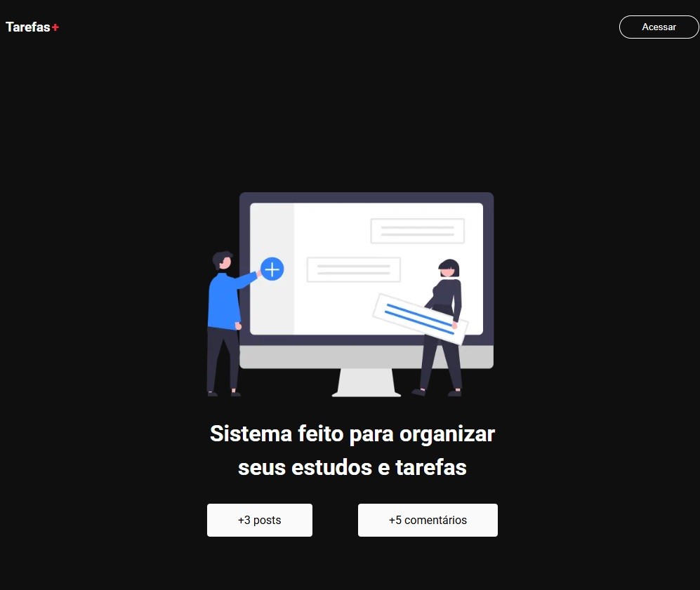
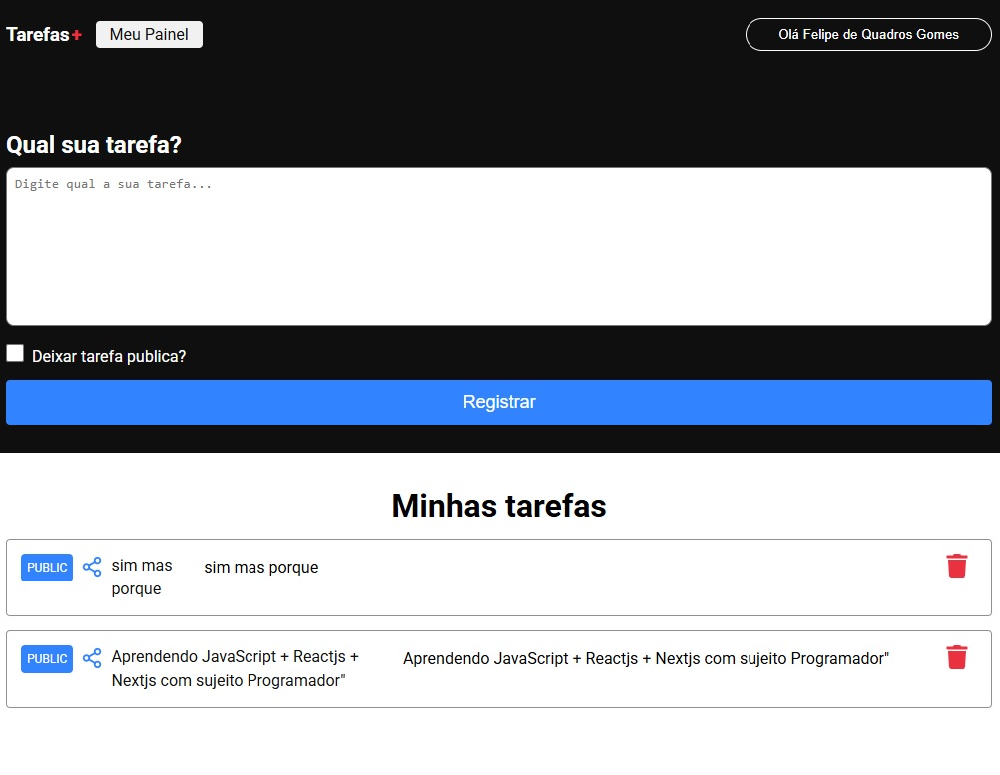
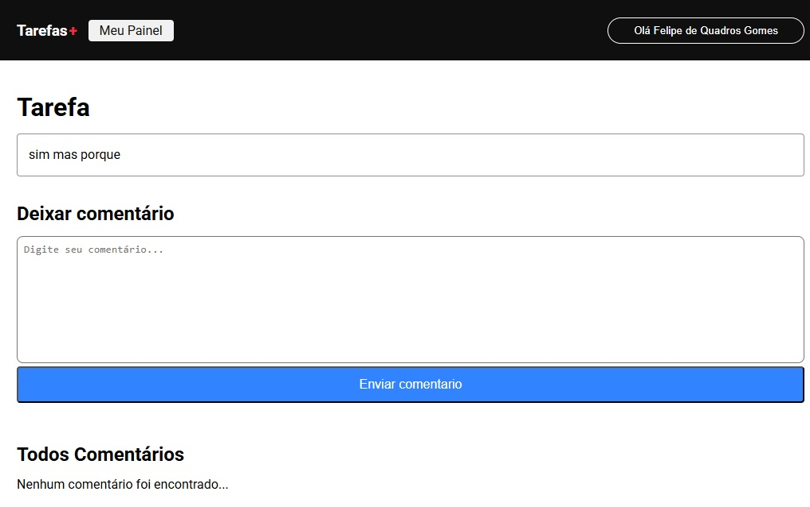

# Projeto Tarefas

## Descrição
Este é um projeto de gerenciamento de tarefas que utiliza NextAuth.jspara autenticação social com Google e Firestore como banco de dados NoSQL. Os usuários podem cadastrar, editar e deletar tarefas, além de compartilhar tarefas públicas com outros usuários através de um link. As tarefas podem ser mantidas privadas, visíveis apenas para o usuário.

## Tecnologias Utilizadas
-**JavaScript**: Linguagem usada no desenvolvimento.

-**Next.js**: Framework para facilitar o desenvolvimento.

-**TypeScript**: Utilizado para tipagem e prevenção de erros em tempo real.

-**NextAuth.js**: Autenticação de login com o Google.

-**Firestore**: Banco de dados NoSQL para armazenamento das tarefas.

-**SSG**: Geração de páginas estáticas durante o build. A revalidação incremental, permite que essas páginas sejam atualizadas intervalos regulares a cada 60 segundos.

-**SSR** (Server-Side Rendering): Renderização das páginas no servidor em tempo real, a cada solicitação, para garantir dados atualizados.

## Funcionalidades
-Cadastro, edição e exclusão de tarefas.

-Compartilhamento de tarefas públicas com outros usuários.

-Tarefas privadas visíveis apenas para o usuário.

-Autenticação segura com Google.

-Interface amigável e responsiva.

## Contato
Email: felipedequadrosgomes@gmail.com

LinkedIn: https://www.linkedin.com/in/felipe-de-quadros-gomes-b990012aa/

Portfólio: https://portifolio-quadros.vercel.app/
